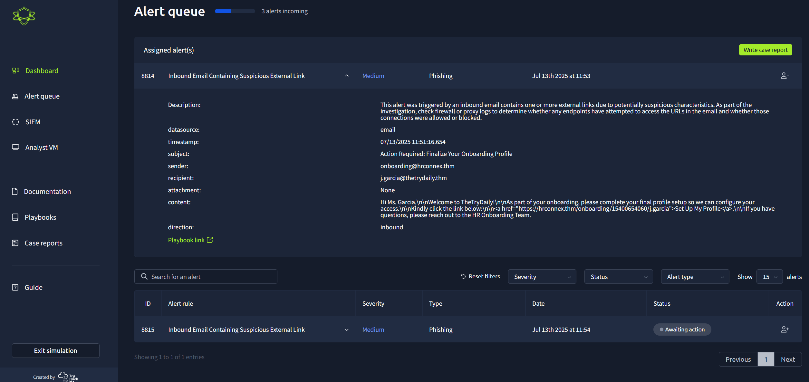
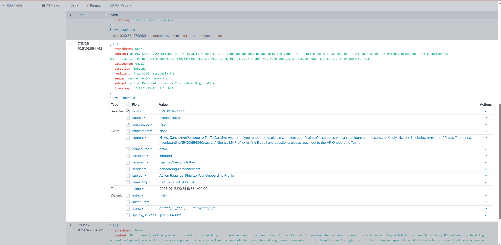
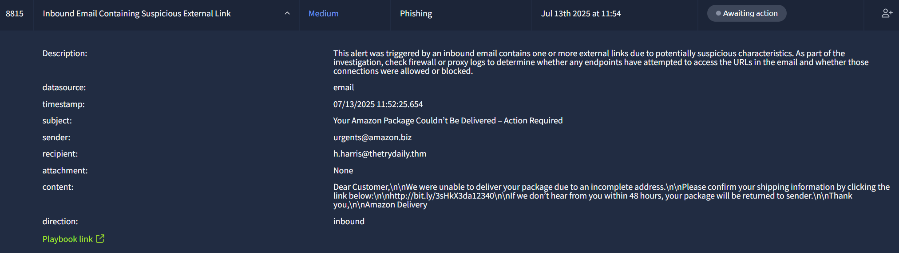
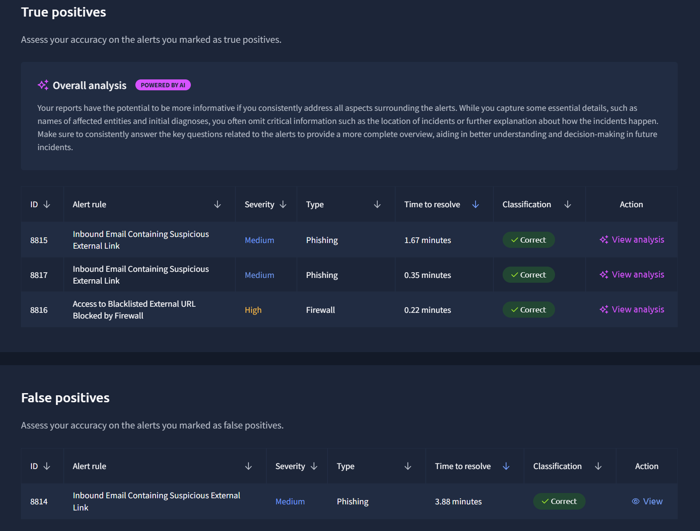

## Phishing Alert Triage Simulation

**Date:** July 13, 2025  
**Platform:** TruHack Cyber Range  
**Scenario:** Inbound Email Alerts Containing Suspicious External Links  
**Role:** SOC Analyst (Alert Triage)

---

### Objective

Classify inbound email alerts as true positives (malicious) or false positives (benign) using content analysis, URL inspection, and domain validation.

---

### Tasks Performed

- Investigated 4 alerts triggered by suspicious email links.
    
- Analyzed message headers, sender domains, content wording, and URLs.
    
- Cross-referenced domains and email intent to determine legitimacy.
    
- Verified findings using log data and Splunk event details.
    

---

### Results

|Metric|Value|
|---|---|
|Total Alerts|4|
|Correct Classifications|4 / 4 (100%)|
|True Positives|3|
|False Positives|1|
|Mean Time to Resolve|2.00 minutes|
|Mean Dwell Time|6.00 minutes|

---

### Notes

- **Phishing (True Positives):**
    
    - One email impersonated Amazon using a bit.ly redirect.
        
    - Others used suspicious domains or urgent language.
        
- **False Positive:**
    
    - HR onboarding email flagged due to a third-party `.thm` domain. Legitimate context confirmed via content and company knowledge.
        
- All classifications were confirmed as correct.
    

---

### Tools Used

- Splunk (log analysis)
    
- TruHack Analyst VM
    
- Alert queue triage dashboard